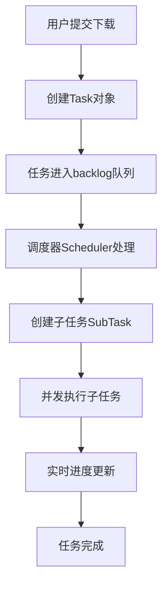

# BiliTools 下载管理流程分析报告

## 1. 项目概述

BiliTools 是一个基于 Tauri（Rust + Vue）构建的跨平台哔哩哔哩工具箱，提供视频、音频、弹幕、字幕等多种资源的下载功能。

**核心特性**：
- 支持视频（DASH/MP4/FLV）、音频（FLAC/MP3）、弹幕（ASS/XML）、字幕（SRT）、NFO元数据等
- 多账号管理，扫码/密码/短信登录
- 任务队列系统，支持暂停、恢复、取消、重试
- 文件自动组织，模板化命名
- 并发控制，可配置最大并发数
- 实时进度反馈

## 2. 整体架构

### 2.1 前后端组织

**架构模式**: Tauri 桌面应用（Rust后端 + Vue前端）

| 层级 | 技术栈 | 主要职责 |
|------|--------|----------|
| **前端** | Vue 3 + TypeScript + Pinia + Tailwind CSS | UI渲染、用户交互、状态管理 |
| **后端** | Rust + Tauri 2.0 | 业务逻辑、文件操作、下载任务执行 |
| **通信** | Tauri命令系统 + 事件系统 | 前后端数据交换、进度推送 |

**关键目录结构**：
```
BiliTools/
├── src/                      # Vue前端源码
│   ├── components/           # UI组件
│   ├── services/             # 业务服务
│   │   ├── backend.ts        # Tauri命令绑定（自动生成）
│   │   ├── queue.ts          # 队列管理
│   │   ├── media/            # 媒体资源处理
│   │   └── utils.ts          # 工具函数
│   ├── store/                # Pinia状态管理
│   └── types/                # TypeScript类型定义
├── src-tauri/                # Rust后端源码
│   ├── src/
│   │   ├── commands.rs       # Tauri命令实现
│   │   ├── services/         # 服务实现
│   │   │   ├── aria2c.rs     # 下载引擎集成
│   │   │   ├── ffmpeg.rs     # 视频处理
│   │   │   ├── login.rs      # 认证服务
│   │   │   └── queue/        # 队列系统
│   │   │       ├── manager.rs      # 队列管理器
│   │   │       ├── scheduler.rs    # 任务调度器
│   │   │       ├── task.rs         # 任务定义
│   │   │       ├── handlers.rs     # 任务处理器
│   │   │       ├── runtime.rs      # 运行时控制
│   │   │       ├── frontend.rs     # 前后端通信
│   │   │       └── atomics.rs      # 原子操作
│   │   └── storage/          # 数据持久化
│   └── Cargo.toml            # Rust依赖配置
└── package.json              # Node.js依赖配置
```

### 2.2 Tauri桌面端的作用

Tauri在BiliTools中提供以下核心能力：

1. **系统集成**：
   - 文件系统访问（创建目录、写入文件）
   - 原生对话框（文件选择、确认对话框）
   - 系统通知（下载完成提醒）
   - 剪贴板操作（监听链接）

2. **性能优势**：
   - Rust处理下载任务、文件操作等密集型任务
   - 前端专注于UI渲染和用户交互

3. **安全沙箱**：
   - 有限的系统权限访问
   - 明确的API边界

4. **跨平台支持**：
   - Windows、macOS、Linux统一构建
   - 原生窗口和系统集成

## 3. 下载功能实现

### 3.1 任务类型系统

BiliTools定义了多种下载任务类型（`src-tauri/src/services/queue/task.rs`）：

```rust
pub enum TaskType {
    OpusContent,      // 专栏内容
    OpusImages,       // 专栏图片
    AiSummary,        // AI总结
    Subtitles,        // 字幕
    AlbumNfo,         // 合集NFO
    SingleNfo,        // 单集NFO
    LiveDanmaku,      // 实时弹幕
    HistoryDanmaku,   // 历史弹幕
    Thumb,            // 封面/缩略图
    Video,            // 视频
    Audio,            // 音频
    AudioVideo,       // 音视频合并
}
```

### 3.2 下载任务流程

#### 3.2.1 单视频下载流程



**详细步骤**：
1. **任务创建** (`src/services/queue.ts`):
   ```typescript
   export async function submit(info: Types.MediaInfo, select: Types.PopupSelect, checkboxs: number[]) {
     for (const idx of checkboxs) {
       const id = randomString(8);
       const subtasks = selectToSubTasks(id, select);
       const view: backend.TaskView = { meta, prepare, hot };
       queue.tasks[id] = { ...view.meta, ...view.prepare, ...view.hot };
       await backend.commands.submitTask(id, view);
     }
   }
   ```

2. **任务调度** (`src/services/queue.ts`):
   ```typescript
   export async function processQueue() {
     const snapshot = queue.tasks[queue.backlog[0]];
     const folder = buildPaths('series', snapshot);
     const scheduler = await backend.commands.planScheduler(sid, folder);
     await backend.commands.processScheduler(sid);
   }
   ```

3. **任务执行** (`src-tauri/src/services/queue/task.rs`):
   ```rust
   pub async fn process(self: &Arc<Self>, sid: &str) -> TauriResult<()> {
     let temp = config::read().temp_dir().join(&**id);
     fs::create_dir_all(&*temp).await?;
     let res = handlers::handle_task(scheduler, &temp, self.clone()).await;
     fs::remove_dir_all(&*temp).await?;
     res
   }
   ```

#### 3.2.2 系列/合集下载逻辑

**调度器模式** (`src-tauri/src/services/queue/scheduler.rs`):
```rust
pub struct Scheduler {
    pub sid: String,
    pub list: RwLock<Vec<String>>,  // 任务ID列表
    pub queue: Atomic<QueueType>,
    pub state: Atomic<SchedulerState>,
    pub folder: PathBuf,            // 输出目录
}
```

**并行处理**：
```rust
pub async fn dispatch(self: Arc<Self>) -> TauriResult<()> {
    let mut set = JoinSet::new();
    for id in list {
        let task = MANAGER.get_task(&id).await?;
        let sem = RUNTIME.semaphore.read().await.clone();
        let permit = sem.acquire_owned().await;
        set.spawn(async move {
            let _permit = permit;
            task.process(&self.sid).await
        });
    }
    while let Some(res) = set.join_next().await {
        // 处理结果
    }
}
```

## 4. 资源获取流程

### 4.1 B站API交互方法

#### 4.1.1 视频信息获取

**API端点** (`src/services/media/data.ts`):
```typescript
export async function getMediaInfo(id: string, type: Types.MediaType) {
  let url = 'https://api.bilibili.com';
  switch (type) {
    case Types.MediaType.Video:
      url += '/x/web-interface/view';
      params = idType === 'bv' ? { bvid: id } : { aid: idNum };
      break;
    case Types.MediaType.Bangumi:
      url += '/pgc/view/web/season';
      // ...
  }
}
```

**响应处理**：
- 解析视频信息（标题、封面、描述、时长等）
- 提取分P信息、合集信息
- 构建MediaItem对象

#### 4.1.2 播放地址获取

**API端点** (`src/services/media/data.ts`):
```typescript
export async function getPlayUrl(item: Types.MediaItem, type: Types.MediaType, codec: Types.StreamFormat) {
  let url = 'https://api.bilibili.com';
  const params = {
    qn: user.isLogin ? 127 : 64,  // 清晰度
    fnver: 0,
    fnval: codec === StreamFormat.Dash ? 4048 : 16,
    fourk: 1,
  };
  
  switch (type) {
    case Types.MediaType.Video:
      url += '/x/player/wbi/playurl';
      Object.assign(params, { avid: item.aid, cid: item.cid });
      break;
    case Types.MediaType.Bangumi:
      url += '/pgc/player/web/v2/playurl';
      // ...
  }
}
```

**格式支持**：
- **DASH**: 视频/音频流分离，支持多码率
- **MP4**: 单文件格式
- **FLV**: 传统流媒体格式

#### 4.1.3 认证机制

**WBI签名认证** (`src/services/auth.ts`):
```typescript
export async function wbi(params: Record<string, string | number | undefined>) {
  // 1. 获取wbi签名密钥
  // 2. 生成签名
  // 3. 添加签名参数
}
```

**Cookie管理**:
- 多账号Cookie存储
- Cookie刷新机制
- 风控验证处理

### 4.2 资源获取具体实现

#### 4.2.1 字幕获取

**流程** (`src/services/media/extras.ts`):
```typescript
export async function getSubtitle(item: Types.MediaItem, options?: { name?: false | string }) {
  // 1. 获取播放器信息
  const playerInfo = await getPlayerInfo(item.aid, item.cid);
  const subtitles = playerInfo.subtitle?.subtitles;
  
  // 2. 获取指定语言字幕
  const subtitle_url = subtitles.find(v => v.lan === options.name)?.subtitle_url;
  
  // 3. 下载并转换为SRT格式
  const subtitle = await tryFetch(subtitle_url);
  return convertToSRT(subtitle.body);
}
```

**SRT格式转换**:
```typescript
const getTime = (s: number) =>
  new Date(s * 1000).toISOString().slice(11, 23).replace('.', ',');
  
return subtitle.body.map((l, i) =>
  `${i + 1}\n${getTime(l.from)} --> ${getTime(l.to)}\n${l.content}`
).join('\n\n');
```

#### 4.2.2 弹幕获取

**实时弹幕** (`src/services/media/extras.ts`):
```typescript
export async function getDanmaku(item: Types.MediaItem, type: string | false) {
  // 1. 获取弹幕分段
  const segs = await getDanmakuSegs(item.cid);
  
  // 2. 下载弹幕XML
  const xml = await downloadDanmakuXML(segs);
  
  // 3. 转换为ASS格式（可选）
  if (config.convert.danmaku) {
    return convertToASS(xml);
  }
  return xml;
}
```

**DanmakuFactory集成** (`src-tauri/src/services/queue/handlers.rs`):
```rust
async fn handle_danmaku(req: &SubTaskReq, ctrl: Arc<CtrlHandle>) -> TauriResult<()> {
  let danmaku = frontend::request::<Vec<u8>>(id, Some(sub_id), &RequestAction::GetDanmaku).await?;
  
  // 写入临时文件
  fs::write(&xml, &*danmaku).await?;
  
  // 调用DanmakuFactory转换
  let (mut child_rx, child) = get_app_handle()
    .shell()
    .sidecar("DanmakuFactory")?
    .args(["-i", xml, "-o", ass, "--ignore-warnings"])
    .spawn()?;
  
  // 等待转换完成
  // ...
}
```

#### 4.2.3 NFO元数据生成

**NFO生成** (`src/services/media/extras.ts`):
```typescript
export async function getNfo(item: Types.MediaItem, nfo: Types.MediaNfo, type: 'album' | 'nfo') {
  const doc = document.implementation.createDocument('', mode, null);
  const root = doc.documentElement;
  
  // 添加标题
  add('title', item.title);
  add('originaltitle', nfo.showtitle);
  
  // 添加演员信息
  if (nfo.credits?.actors) {
    nfo.credits.actors.forEach(actor => {
      add('actor', null, actorNode)
        .add('name', actor.name)
        .add('role', actor.role);
    });
  }
  
  // 添加封面
  if (nfo.thumbs.length) {
    nfo.thumbs.forEach(thumb => {
      add('thumb', thumb.url, thumbNode);
    });
  }
  
  return new XMLSerializer().serializeToString(doc);
}
```

## 5. 文件整理和重命名逻辑

### 5.1 命名模板系统

**模板定义** (`src/types/shared.d.ts`):
```typescript
export const NamingTemplates = {
  series: {
    general: ['showtitle', 'container'],
    down: ['pubtime', 'downtime', 'upper', 'upperid'],
    ids: ['aid', 'sid', 'fid', 'cid', 'bvid', 'epid', 'ssid', 'opid'],
  },
  item: {
    general: ['showtitle', 'title', 'container', 'mediaType'],
    down: ['index', 'pubtime', 'downtime', 'upper', 'upperid'],
    ids: ['aid', 'sid', 'fid', 'cid', 'bvid', 'epid', 'ssid', 'opid'],
  },
  file: {
    general: ['showtitle', 'title', 'container', 'mediaType', 'taskType'],
    down: ['index', 'pubtime', 'downtime', 'upper', 'upperid'],
    ids: ['aid', 'sid', 'fid', 'cid', 'bvid', 'epid', 'ssid', 'opid'],
    stream: ['res', 'abr', 'enc', 'fmt'],
  },
};
```

**默认模板** (`src-tauri/src/shared.rs`):
```rust
format: SettingsFormat {
  series: "{container} - {showtitle} ({downtime:YYYY-MM-DD_HH-mm-ss})".into(),
  item: "({index}) {mediaType} - {title}".into(),
  file: "{taskType} - {title}".into(),
},
```

### 5.2 路径构建逻辑

**模板解析** (`src/services/queue.ts`):
```typescript
function buildPaths(scope: keyof typeof Types.NamingTemplates, task: Types.Task, subtask?: Types.SubTask) {
  const template = useSettingsStore().format[scope];
  const data = {
    showtitle: nfo.showtitle,
    title: item.title,
    container: t('mediaType.' + task.type),
    mediaType: t('mediaType.' + item.type),
    pubtime: nfo.premiered ?? item.pubtime,
    upper: nfo.upper?.name,
    aid: item.aid,
    cid: item.cid,
    bvid: item.bvid,
    index: task.seq + 1,
    downtime: task.ts,
  };
  
  return template.replace(/\{([^{}]+)\}/g, (full, inner) => {
    const [key, format] = inner.split(':');
    if (key === 'pubtime' || key === 'downtime') {
      return dayjs(new Date(data[key] * 1000)).format(format ?? 'YYYY-MM-DD_HH-mm-ss');
    }
    return String(data[key] ?? '');
  }).replace(/[/\\:*?"<>|]/g, '_');
}
```

**文件组织设置**:
```rust
pub organize: SettingsOrganize {
  auto_rename: true,  // 自动重命名
  top_folder: true,   // 顶层文件夹（系列名）
  sub_folder: true,   // 子文件夹（项目名）
},
```

### 5.3 输出目录结构

**默认组织方式**:
```
下载目录/
├── 系列文件夹/                    # {container} - {showtitle} ({downtime})
│   ├── 项目文件夹/                # ({index}) {mediaType} - {title}
│   │   ├── Video - 视频标题.mp4
│   │   ├── Audio - 音频标题.m4a
│   │   ├── HistoryDanmaku - 弹幕.ass
│   │   ├── Subtitles - 字幕.srt
│   │   ├── SingleNfo - 视频标题.nfo
│   │   └── Cover.jpg
│   └── tvshow.nfo                # 合集NFO
└── 其他文件/
```

## 6. 任务队列和并发控制

### 6.1 队列管理架构

**四级队列系统** (`src-tauri/src/services/queue/manager.rs`):
```rust
pub struct Manager {
    pub schedulers: RwLock<HashMap<String, Arc<Scheduler>>>,
    pub tasks: RwLock<HashMap<String, Arc<Task>>>,
    pub backlog: RwLock<VecDeque<String>>,   // 待处理任务
    pub pending: RwLock<VecDeque<String>>,   // 已规划调度器
    pub doing: RwLock<VecDeque<String>>,     // 执行中
    pub complete: RwLock<VecDeque<String>>,  // 已完成
}
```

**状态转移**:
```
backlog → pending → doing → complete
   ↑         ↓        ↓
   └─────────┴────────┘ (暂停/失败/取消)
```

### 6.2 并发控制机制

**信号量控制** (`src-tauri/src/services/queue/runtime.rs`):
```rust
pub struct Runtime {
    pub semaphore: RwLock<Semaphore>,  // 控制最大并发数
    pub ctrl: Ctrl,                    // 任务控制
}

impl Runtime {
    pub fn new() -> Self {
        let max_conc = config::read().max_conc;
        Self {
            semaphore: RwLock::new(Semaphore::new(max_conc)),
            ctrl: Ctrl::new(),
        }
    }
}
```

**任务控制句柄**:
```rust
pub struct CtrlHandle {
    pub tx: Sender<CtrlEvent>,        // 控制事件通道
    pub cancel: CancellationToken,    // 取消令牌
    pub paused: AtomicBool,           // 暂停状态
    pub cleaners: RwLock<Vec<CleanFn>>, // 清理函数
    pub epoch: AtomicUsize,           // 代次（用于重试）
}
```

### 6.3 任务状态管理

**任务状态** (`src-tauri/src/services/queue/atomics.rs`):
```rust
pub enum TaskState {
    Backlog,     // 待处理
    Pending,     // 已规划
    Active,      // 执行中
    Completed,   // 已完成
    Paused,      // 已暂停
    Failed,      // 失败
    Cancelled,   // 已取消
}
```

**调度器状态**:
```rust
pub enum SchedulerState {
    Idle,        // 空闲
    Running,     // 运行中
    Paused,      // 已暂停
    Completed,   // 已完成
    Failed,      // 失败
    Cancelled,   // 已取消
}
```

## 7. 前端状态管理和进度展示

### 7.1 Pinia状态管理

**队列状态** (`src/store/queue.ts`):
```typescript
interface State {
  tasks: Record<string, Task>;
  schedulers: Record<string, Scheduler>;
  backlog: string[];
  pending: string[];
  doing: string[];
  complete: string[];
}

export const useQueueStore = defineStore('queue', {
  state: (): State => ({
    tasks: {},
    schedulers: {},
    backlog: [],
    pending: [],
    doing: [],
    complete: [],
  }),
});
```

**设置状态** (`src/store/settings.ts`):
```typescript
export const useSettingsStore = defineStore('settings', {
  state: (): Settings => ({
    auto_download: false,
    max_conc: 3,
    format: {
      series: "{container} - {showtitle} ({downtime:YYYY-MM-DD_HH-mm-ss})",
      item: "({index}) {mediaType} - {title}",
      file: "{taskType} - {title}",
    },
    // ...
  }),
});
```

### 7.2 进度展示组件

**任务组件** (`src/components/DownPage/Task.vue`):
- 显示任务标题、时间戳、选择参数
- 进度条显示 (`ProgressBar` 组件)
- 控制按钮 (暂停、恢复、取消、重试)

**进度计算**:
```typescript
function getProgress(task: Types.Task) {
  const subtasks = task.subtasks;
  let chunk = 0;
  for (const v of Object.values(queue.tasks[task.id].status)) {
    chunk += v.chunk / v.content || 0;
  }
  return (chunk / subtasks.length || 0) * 100;
}
```

**队列组件** (`src/components/DownPage/Queue.vue`):
- 显示四个队列标签页（待处理、已规划、执行中、已完成）
- 支持批量操作
- 虚拟列表优化性能

### 7.3 前后端通信机制

**事件系统** (`src-tauri/src/services/queue/frontend.rs`):
```rust
pub enum QueueEvent<'a> {
    TaskUpdated { id, state, prepare, cancelled },
    SchedulerUpdated { id, state, queue, list, cancelled },
    Progress { task, subtask, content, chunk },
    Queue { name, value },
    Request { task, subtask, action, endpoint },
    Error { task, subtask, message, code },
}
```

**前端事件处理** (`src/services/queue.ts`):
```typescript
export async function handleEvent(event: backend.QueueEvent) {
  const { type } = event;
  if (type === 'progress') {
    const status = queue.tasks?.[event.task]?.status?.[event.subtask];
    if (status) {
      status.content = event.content;
      status.chunk = event.chunk;
    }
  } else if (type === 'request') {
    // 处理后端请求
    result = await handleTask(task, event.action, subtask);
    app.emit(event.endpoint, result);
  }
}
```

**后端请求前端数据**:
```rust
pub async fn request<T: DeserializeOwned + Send + 'static>(
    task: &str,
    subtask: Option<&str>,
    action: &RequestAction,
) -> TauriResult<T> {
    let (tx, rx) = oneshot::channel();
    let endpoint = format!("{task}_{}_{ts}", action.as_string());
    
    app.once(endpoint, move |event| {
        let _ = tx.send(serde_json::from_str::<Option<T>>(event.payload()));
    });
    
    QueueEvent::Request { task, subtask, action, endpoint }.emit(app)?;
    let res = rx.await??;
    Ok(res.ok_or(anyhow!("Error occurred from frontend"))?)
}
```

## 8. 下载引擎集成

### 8.1 Aria2c下载器集成

**Aria2c RPC通信** (`src-tauri/src/services/aria2c.rs`):
```rust
pub async fn download(req: &SubTaskReq, ctrl: Arc<CtrlHandle>, urls: &Vec<String>) -> TauriResult<PathBuf> {
    let gid = &req.subtask.id;
    
    // 1. 检查是否已完成
    let result = ARIA2_RPC.request::<Aria2TellStatus>("tellStatus", vec![json!(gid)]).await;
    
    // 2. 添加下载任务
    ARIA2_RPC.request::<Value>("addUri", vec![
        json!(urls),
        json!({"dir": req.temp, "out": name, "gid": gid}),
    ]).await?;
    
    // 3. 监控进度
    loop {
        let data = ARIA2_RPC.request::<Aria2TellStatus>("tellStatus", vec![json!(gid)]).await?;
        match data.status.as_str() {
            "active" => {
                sub.send(content, chunk).await?;
            },
            "complete" => {
                sub.send(content, content).await?;
                break;
            },
            _ => (),
        }
        sleep(Duration::from_secs(1)).await;
    }
    Ok(output)
}
```

**Aria2c配置**:
```rust
.args([
    "--enable-rpc".into(),
    "--rpc-listen-all=false".into(),
    "--disable-ipv6=true".into(),
    format!("--max-download-limit={}K", cfg.speed_limit),
    "--referer=https://www.bilibili.com/".into(),
    "--header=Origin: https://www.bilibili.com".into(),
    format!("--user-agent={USER_AGENT}"),
    format!("--rpc-listen-port={port}"),
    format!("--rpc-secret={secret}"),
])
```

### 8.2 FFmpeg处理

**视频合并** (`src-tauri/src/services/ffmpeg.rs`):
```rust
pub async fn merge(req: &SubTaskReq, ctrl: Arc<CtrlHandle>, video: &Path, audio: &Path, ext: &str) -> TauriResult<PathBuf> {
    let output = req.temp.join(format!("{}.{ext}", req.task.id));
    
    let mut c = app
        .shell()
        .sidecar("ffmpeg")?
        .args(["-hide_banner", "-nostats", "-loglevel", "warning"])
        .arg("-i").arg(video)
        .arg("-i").arg(audio)
        .args(["-c", "copy", "-shortest"])
        .arg(&output);
    
    // 执行FFmpeg命令
    // ...
}
```

**其他FFmpeg功能**:
- 音频转MP3 (`convert_mp3`)
- 视频转MP4 (`convert_mp4`)
- 元数据添加 (`add_meta`)
- 弹幕转换 (XML→ASS)

### 8.3 DanmakuFactory集成

**弹幕转换** (`src-tauri/src/services/queue/handlers.rs`):
```rust
async fn handle_danmaku(req: &SubTaskReq, ctrl: Arc<CtrlHandle>) -> TauriResult<()> {
    let cfg = WORKING_PATH.join("DanmakuFactory.json");
    
    let (mut child_rx, child) = get_app_handle()
        .shell()
        .sidecar("DanmakuFactory")?
        .args([
            "-c", cfg.to_string_lossy().as_ref(),
            "-i", xml.to_string_lossy().as_ref(),
            "-o", ass.to_string_lossy().as_ref(),
            "--ignore-warnings",
        ])
        .spawn()?;
    
    // 监控输出
    while let Some(msg) = child_rx.recv().await {
        match msg {
            CommandEvent::Stdout(line) => log::info!("{}", String::from_utf8_lossy(&line)),
            CommandEvent::Stderr(line) => log::warn!("{}", String::from_utf8_lossy(&line)),
            CommandEvent::Terminated(msg) => {
                if msg.code.unwrap_or(-1) != 0 {
                    return Err(TauriError::new("DanmakuFactory failed", Some(code)));
                }
            }
        }
    }
    
    // 复制结果文件
    fs::copy(&ass, get_unique_path(PathBuf::from(format!("{output_file}.ass")))).await?;
}
```

## 9. 对 PiliNote 的参考价值

### 9.1 建议采用的架构模式

1. **任务队列系统**:
   - 四级队列（待处理、已规划、执行中、已完成）
   - 调度器模式管理系列任务
   - 任务状态机管理

2. **并发控制**:
   - 信号量控制最大并发数
   - 任务控制句柄支持暂停/恢复/取消
   - 清理函数机制

3. **文件组织**:
   - 模板化命名系统
   - 可配置的目录结构
   - 自动重命名和冲突处理

4. **状态管理**:
   - Pinia集中状态管理
   - 实时进度同步
   - 持久化存储

5. **资源获取**:
   - 模块化API客户端
   - 统一错误处理
   - 重试机制

6. **下载引擎**:
   - Aria2c + FFmpeg组合
   - RPC通信控制
   - 实时进度监控

### 9.2 可改进的方面

1. **错误处理**:
   - 更细粒度的错误分类
   - 智能重试策略
   - 错误恢复机制

2. **缓存机制**:
   - API响应缓存
   - 视频信息缓存
   - 避免重复下载

3. **插件系统**:
   - 支持扩展下载源
   - 自定义处理器
   - 事件钩子系统

4. **性能优化**:
   - 增量下载
   - 断点续传优化
   - 内存使用优化

5. **用户体验**:
   - 更好的进度反馈
   - 批量操作优化
   - 移动端适配

## 10. 关键文件索引

### 10.1 前端核心文件

| 文件路径 | 功能描述 |
|----------|----------|
| `src/services/queue.ts` | 队列管理、任务提交、事件处理 |
| `src/services/backend.ts` | Tauri命令绑定（自动生成） |
| `src/services/media/data.ts` | 视频信息、播放地址获取 |
| `src/services/media/extras.ts` | 字幕、弹幕、NFO生成 |
| `src/services/auth.ts` | 认证、签名、Cookie管理 |
| `src/store/queue.ts` | 队列状态管理 |
| `src/store/settings.ts` | 设置状态管理 |
| `src/components/DownPage/Task.vue` | 任务展示组件 |
| `src/components/DownPage/Queue.vue` | 队列展示组件 |

### 10.2 后端核心文件

| 文件路径 | 功能描述 |
|----------|----------|
| `src-tauri/src/commands.rs` | Tauri命令实现 |
| `src-tauri/src/services/queue/manager.rs` | 队列管理器 |
| `src-tauri/src/services/queue/scheduler.rs` | 任务调度器 |
| `src-tauri/src/services/queue/task.rs` | 任务定义和处理 |
| `src-tauri/src/services/queue/handlers.rs` | 各种任务类型处理器 |
| `src-tauri/src/services/queue/runtime.rs` | 运行时控制、并发管理 |
| `src-tauri/src/services/queue/frontend.rs` | 前后端通信 |
| `src-tauri/src/services/aria2c.rs` | Aria2c下载引擎集成 |
| `src-tauri/src/services/ffmpeg.rs` | FFmpeg视频处理 |
| `src-tauri/src/shared.rs` | 共享配置、工具函数 |

### 10.3 类型定义文件

| 文件路径 | 功能描述 |
|----------|----------|
| `src/types/shared.d.ts` | 共享类型定义（任务、队列、设置） |
| `src/types/media/data.d.ts` | 媒体数据响应类型 |
| `src/types/media/extras.d.ts` | 额外资源类型 |
| `src-tauri/src/services/queue/types.rs` | 后端类型定义 |

## 总结

BiliTools 项目展示了如何构建一个功能完整的B站下载工具，其架构设计和实现细节具有以下特点：

1. **清晰的分层架构**: 前端负责UI，后端负责业务逻辑，通过Tauri命令系统通信
2. **灵活的任务系统**: 支持多种任务类型，可扩展的处理器架构
3. **强大的队列管理**: 四级队列、调度器模式、并发控制
4. **完善的资源处理**: 视频、音频、弹幕、字幕、元数据全覆盖
5. **优秀的用户体验**: 实时进度、暂停/恢复、文件自动组织

这些设计模式和技术选型对PiliNote的开发具有重要参考价值，可以根据具体需求进行适当的调整和优化。