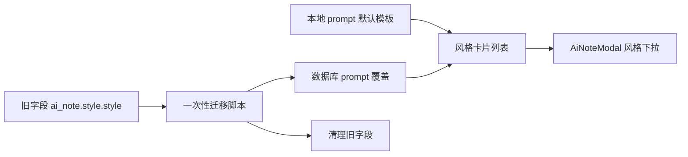

# Prompt 风格来源迁移设计

## 背景
PiliNote 当前同时存在两套“风格”概念：

1. 旧配置字段 `ai_note.style.style`
2. `prompt管理` 面板中的风格卡片

当前 AI 笔记弹窗仍在读取旧字段，这导致：

- 弹窗显示的风格值与 `prompt管理` 不一致
- 用户在设置页新增或修改的风格卡片没有成为主来源
- 旧字段继续参与运行时读取，造成来源混乱

## 目标

- `AiNoteModal` 只从 `prompt管理` 的风格卡片读取可选风格
- 内置风格与自定义风格统一进入同一风格列表
- 旧字段 `ai_note.style.style` 不再作为运行时主来源
- 迁移完成后清理旧字段，避免继续混用

## 范围

### 需要迁移的内容

- `ai_note.style.style`
- 旧风格值到新风格值的映射
  - `concise` -> `minimal`
  - `detailed` -> `detailed`
  - `bullet` -> `task_oriented`
- 弹窗风格下拉的数据源
- 风格默认值选择逻辑

### 不在本次范围内

- `T0 / T1 / T2 / T3` prompt 卡片编辑逻辑
- 本地 ASR 模型管理面板
- AI 服务商配置结构
- prompt 模板本地文件结构

## 方案

### 运行时读取

弹窗风格列表由 `prompt管理` 的风格卡片生成：

- 先读取本地 prompt 默认模板
- 再读取数据库中的 prompt 覆盖
- 组合成风格卡片列表
- 选择时只写入新风格值

### 一次性迁移脚本

提供一次性迁移脚本，执行以下操作：

1. 读取数据库中的旧字段 `ai_note.style.style`
2. 将旧值映射到新风格值
3. 如有必要，将迁移后的默认风格写入新的风格来源
4. 清理旧字段，停止后续读取
5. 生成迁移标记，防止重复执行

### 兼容策略

- 迁移脚本完成后，运行时代码不再依赖旧字段
- 若新风格列表为空，回退到 `prompt管理` 风格卡片中的第一项
- 不回退到旧字段默认值

## 数据流

## 验收标准

- AI 笔记弹窗的风格列表来自 `prompt管理`
- 内置风格和自定义风格都可见
- 旧字段不再影响弹窗默认值
- 迁移脚本可重复检测且不会重复迁移
- 迁移后数据库中不再依赖 `ai_note.style.style` 作为主输入

## 风险与处理

- 风格卡片与旧值名称不一致时，优先使用新风格值
- 如果数据库里存在未识别旧值，回退到 `prompt管理` 第一项风格
- 迁移失败时保留原值并输出日志，不直接破坏现有配置

