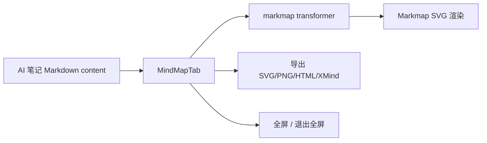

# AI 笔记导图 Tab 设计

> **For agentic workers:** 需根据此 spec 创建实现计划 (writing-plans skill)

**Goal:** 在 `AI 笔记` 面板中新增一个“导图” tab，直接根据当前笔记 Markdown 动态生成思维导图，并提供参考项目里的全屏与导出工具栏能力。

**Architecture:** 前端基于当前笔记 Markdown 实时转换为 markmap 数据并渲染到 SVG；导图与正文共享同一份内容源，不依赖后端预计算的 mindmap 数据，默认只读显示。

**Tech Stack:** React + TypeScript + Vite, `markmap` 生态包, existing AI note markdown content and local note file APIs

---

## 一、现状与参考实现

参考项目 `BiliNote` 的实现方式很直接：

- `MarkdownViewer` 维护一个 `viewMode: 'preview' | 'map'`
- 切到 `map` 时，直接渲染 `MarkmapComponent`
- `MarkmapComponent` 用 `transformer.transform(markdown)` 将 Markdown 转成树结构
- 再用 `Markmap.create(svg)` 和 `mm.setData(root).then(mm.fit())` 画到 SVG 上
- 工具栏提供导出 `SVG`、`PNG`、`HTML`、`XMind`，并支持全屏 / 退出全屏

当前项目里已经有 AI 笔记的 Markdown 文档能力，但还没有一个独立的导图 tab。现有 `mindmap_json` 字段只是模型层预留，没有实际参与页面渲染。

---

## 二、目标与非目标

### 目标

- 在 `AiNotePanel` 中新增 `导图` tab
- 导图内容直接来自当前笔记 Markdown 全文
- 只抽取标题和列表结构生成导图节点
- 提供参考项目里的导出与全屏工具栏：
  - 导出 SVG
  - 导出 PNG
  - 导出 HTML
  - 导出 XMind
  - 全屏 / 退出全屏
- 导图随正文内容变化实时更新
- 保持页面内 tab 切换体验，和字幕 / 笔记 tab 一致

### 非目标

- 不在第一版把导图做成可编辑内容
- 不在第一版把 mindmap 数据回写到后端做缓存
- 不重做字幕 tab
- 不把整站所有 Markdown 页面迁移到同一套导图组件

---

## 三、方案对比

### 方案 A：前端动态 markmap 渲染，推荐

**结构**
- `NoteTab` 提供当前笔记 Markdown
- 新增 `MindMapTab`
- `MindMapTab` 内部用 markmap 生态包将 Markdown 转为 SVG 导图
- 导图工具栏直接在前端完成导出和全屏

**优点**
- 和参考项目一致
- 实时性最好
- 不需要新增后端存储和同步逻辑
- 改动范围可控

**缺点**
- 需要引入或补全 markmap 相关前端依赖
- 大文档下转换和渲染会有前端性能成本

### 方案 B：后端预生成 mindmap_json

**优点**
- 前端更轻
- 后续可以复用导图缓存

**缺点**
- 正文修改后需要同步维护缓存
- 导图和正文容易出现不同步
- 第一版复杂度更高

### 方案 C：手写 Markdown 树解析与 SVG 渲染

**优点**
- 完全可控

**缺点**
- 工作量大
- 维护成本高
- 很容易变成另一套自研渲染器

**结论：采用方案 A。**

---

## 四、设计方案

### 1. Tab 结构

在 `AiNotePanel` 中新增一个 tab：

- `字幕`
- `笔记`
- `导图`

导图 tab 是独立内容区，不改变字幕和笔记的业务逻辑。

### 2. 数据来源

导图输入直接使用当前笔记 Markdown 全文：

- 进入 `NoteTab` 后已经加载的 `content`
- 导图 tab 切换时复用同一份内容源
- 如果笔记内容变化，导图实时重算

第一版只抽取：

- `# / ## / ### ...` 标题层级
- 无序列表 / 有序列表结构

以下内容默认不展开为主节点：

- 代码块
- 图片
- 表格
- 引用块

这样可以避免导图过于拥挤。

### 3. 导图渲染组件

新增一个专用组件，例如：

- `apps/web/src/pages/components/AiNotePanel/MindMapTab.tsx`

组件职责：

- 接收笔记 Markdown 文本
- 用 markmap transformer 转成树
- 初始化 `Markmap` 实例
- 在 Markdown 更新时重新 setData + fit
- 管理全屏状态和导出按钮

导图组件内部只负责展示，不负责笔记保存、版本管理或 AI 任务控制。

### 4. 工具栏

参考项目里的工具栏能力需要一起带上：

- 全屏 / 退出全屏
- 导出 SVG
- 导出 PNG
- 导出 HTML
- 导出 XMind

工具栏位置建议放在导图区域右上角或顶部浮层，和参考项目的交互保持一致。

### 5. 样式与布局

导图 tab 的整体布局建议：

- 顶部保持与现有 tab 一致的页面壳层
- 中间是可撑满的导图画布
- 导图画布允许滚动 / 缩放后的查看
- 默认背景可跟随当前主题，但导出 SVG/PNG/HTML 时仍按参考项目的可视化需求处理

第一版不强行把导图做成卡片风格，而是优先保证：

- 结构清晰
- 节点可读
- 全屏导出可靠

### 6. 与当前 NoteTab 的关系

导图 tab 不需要重新加载笔记文件：

- `NoteTab` 继续负责笔记内容编辑和保存
- `MindMapTab` 复用相同的笔记 `content`
- 当 `NoteTab` 保存后，导图 tab 通过 props 或共享状态刷新

如果 tab 切换时组件会被卸载，则需要像当前 `AiNotePanel` 一样做常驻挂载，避免重复初始化 markmap 实例。

---

## 五、数据流

运行路径：

1. `NoteTab` 加载或更新笔记内容
2. `MindMapTab` 接收当前 Markdown
3. markmap 只抽取标题和列表结构
4. SVG 图实时刷新
5. 用户可用工具栏导出或全屏查看

---

## 六、实现边界

### 前端新增

- `apps/web/src/pages/components/AiNotePanel/MindMapTab.tsx`

### 前端修改

- `apps/web/src/pages/components/AiNotePanel/index.tsx`
- `apps/web/src/pages/components/AiNotePanel/NoteTab.tsx`
- `apps/web/src/pages/components/AiNotePanel/TranscriptTab.tsx` 不需要逻辑改动，但 tab 结构要保持一致
- `apps/web/package.json`
- `apps/web/pnpm-lock.yaml`

### 前端可能需要的依赖

根据当前工程实际导入方式补齐 markmap 生态包，通常包括：

- `markmap-lib`
- `markmap-view`
- `markmap-toolbar`
- `markmap-common`

### 后端

- 第一版不改后端
- `mindmap_json` 继续作为预留字段，不参与主流程

---

## 七、错误处理

导图 tab 需要覆盖这些失败场景：

- Markdown 为空
  - 显示空状态，不报错
- markmap 解析失败
  - 显示兜底提示，不影响页面其它 tab
- SVG 渲染异常
  - 记录日志并显示可恢复的错误提示
- 导出失败
  - toast 提示失败原因，页面继续可用
- 全屏 API 不可用
  - 降级为普通查看，不阻断导图内容

导图 tab 不能影响：

- 笔记保存
- 笔记重新生成
- 字幕纠正流程

---

## 八、测试与验证

建议至少验证以下路径：

- 切到导图 tab 后可以正常显示当前笔记结构
- 笔记内容修改后导图能更新
- 长文档下导图不白屏
- 全屏 / 退出全屏可用
- 导出 SVG / PNG / HTML / XMind 可用
- 只包含标题和列表的内容能正确生成导图
- 空笔记时能显示空态

---

## 九、风险与缓解

- **风险：导图过大时前端渲染变慢**
  - 缓解：先只做当前笔记全文的前端动态渲染，必要时再加缓存
- **风险：markmap 依赖包与当前 Vite/TypeScript 集成不一致**
  - 缓解：先按参考项目最小集成，必要时补类型声明
- **风险：导图和正文状态不同步**
  - 缓解：导图组件直接吃同一份 `content`，并在保存后触发刷新
- **风险：工具栏能力做全但界面过重**
  - 缓解：第一版只保留参考项目必需能力，不加额外功能

---

## 十、结论

这一轮导图 tab 的最佳实现方式是：

- 前端动态生成
- 输入使用当前笔记 Markdown 全文
- 只抽标题和列表结构
- 复用参考项目的全屏和导出能力
- 不引入后端缓存作为第一版依赖

这能最小化改动，并且和参考项目的交互模型保持一致。
